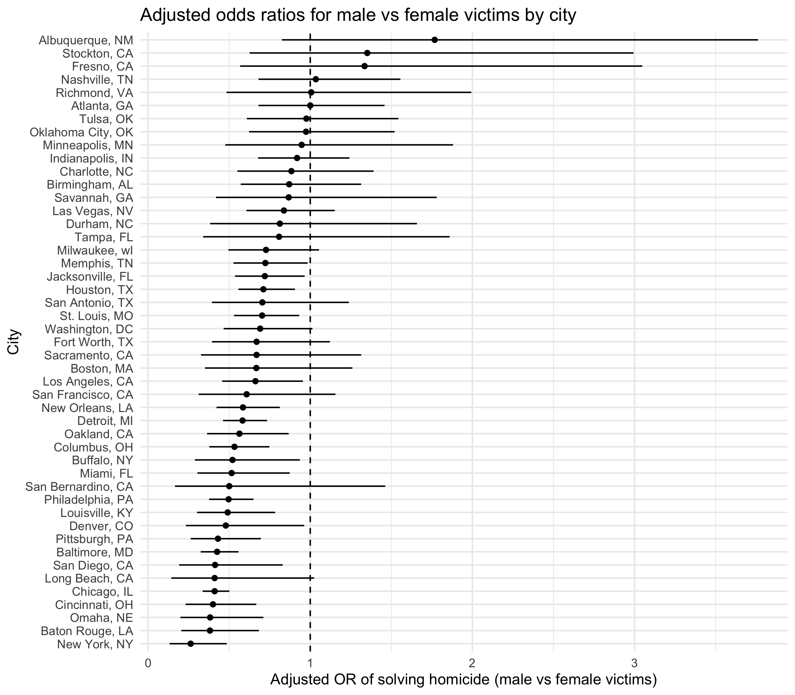
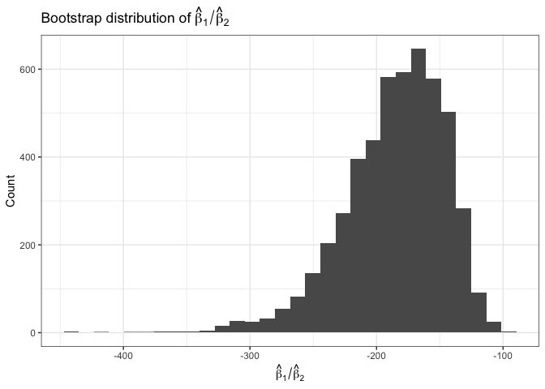
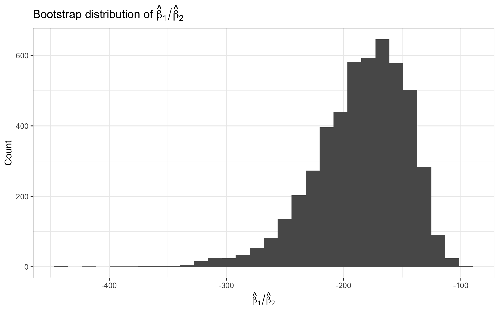
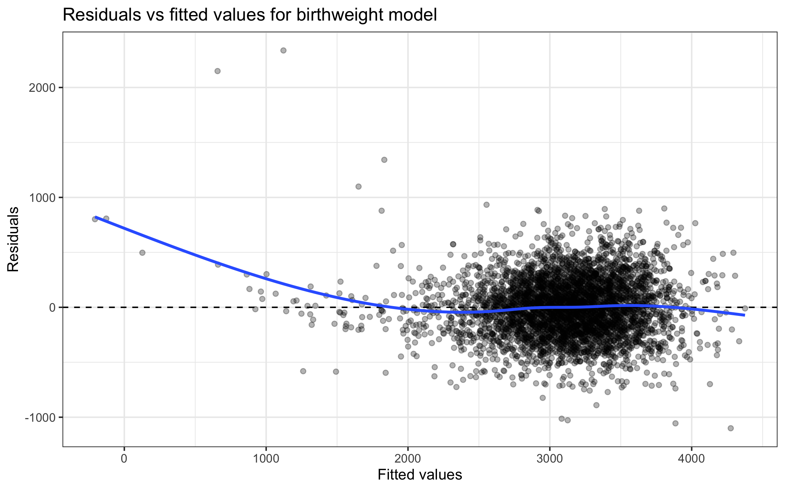

Homework 6
================
Xinyin Miao (xm2356)
2025-11-22

# Problem 1

``` r
homicides <- readr::read_csv("data/homicide-data.csv") |>
  clean_names() |>
  mutate(
    city_state = str_c(city, ", ", state),
    solved = if_else(disposition == "Closed by arrest", 1L, 0L),
    victim_sex  = na_if(victim_sex,  "Unknown"),
    victim_race = na_if(victim_race, "Unknown"),
    victim_age = ifelse(victim_age %in% c("Unknown", ""), NA, victim_age),
    victim_age = as.numeric(victim_age)
    ) |>
  filter(!city_state %in% c("Dallas, TX", "Phoenix, AZ", "Kansas City, MO", "Tulsa, AL"),
         victim_race %in% c("White", "Black")
         ) |>
  mutate(
    victim_sex  = factor(victim_sex,  levels = c("Female", "Male")),
    victim_race = factor(victim_race, levels = c("White", "Black"))
  )
```

    ## Rows: 52179 Columns: 12
    ## ── Column specification ────────────────────────────────────────────────────────
    ## Delimiter: ","
    ## chr (9): uid, victim_last, victim_first, victim_race, victim_age, victim_sex...
    ## dbl (3): reported_date, lat, lon
    ## 
    ## ℹ Use `spec()` to retrieve the full column specification for this data.
    ## ℹ Specify the column types or set `show_col_types = FALSE` to quiet this message.

## For Baltimore,MD

``` r
baltimore <-
  homicides |>
  filter(city_state == "Baltimore, MD")

baltimore_glm <-
  glm(
    solved ~ victim_age + victim_sex + victim_race,
    data   = baltimore,
    family = binomial()
  )
```

``` r
baltimore_results <-
  baltimore_glm |>
  tidy(
    conf.int     = TRUE,
    exponentiate = TRUE 
  )

baltimore_male_female_or <-
  baltimore_results |>
  filter(term == "victim_sexMale") |>
  select(term, estimate, conf.low, conf.high)

baltimore_male_female_or |> 
  knitr::kable(digits = 4)
```

| term           | estimate | conf.low | conf.high |
|:---------------|---------:|---------:|----------:|
| victim_sexMale |   0.4255 |   0.3242 |    0.5576 |

``` r
# the estimate and CI of the adjusted odds ratio for solving homicides comparing male to female victims keeping all other variables fixed
```

## For each of the cities

``` r
city_results <-
  homicides |>
  nest(data = -city_state) |>
  mutate(
    model = map(data, \(df) glm( solved ~ victim_age + victim_sex + victim_race,  data   = df, family = binomial())
    ),
    tidied = map(model, \(m) tidy(m,
        conf.int     = TRUE,
        exponentiate = TRUE
      )
    )
  ) |>
  select(city_state, tidied) |>
  unnest(tidied) |>
  filter(term == "victim_sexMale") |> 
  select(city_state, estimate, conf.low, conf.high) |> 
  arrange(desc(estimate))

city_results |> 
  knitr::kable(digits = 4)
```

| city_state         | estimate | conf.low | conf.high |
|:-------------------|---------:|---------:|----------:|
| Albuquerque, NM    |   1.7675 |   0.8247 |    3.7619 |
| Stockton, CA       |   1.3517 |   0.6256 |    2.9941 |
| Fresno, CA         |   1.3352 |   0.5673 |    3.0475 |
| Nashville, TN      |   1.0342 |   0.6807 |    1.5560 |
| Richmond, VA       |   1.0061 |   0.4835 |    1.9936 |
| Atlanta, GA        |   1.0001 |   0.6803 |    1.4583 |
| Tulsa, OK          |   0.9758 |   0.6091 |    1.5439 |
| Oklahoma City, OK  |   0.9741 |   0.6229 |    1.5200 |
| Minneapolis, MN    |   0.9470 |   0.4759 |    1.8810 |
| Indianapolis, IN   |   0.9187 |   0.6785 |    1.2413 |
| Charlotte, NC      |   0.8839 |   0.5507 |    1.3906 |
| Birmingham, AL     |   0.8700 |   0.5714 |    1.3138 |
| Savannah, GA       |   0.8670 |   0.4186 |    1.7802 |
| Las Vegas, NV      |   0.8373 |   0.6059 |    1.1511 |
| Durham, NC         |   0.8124 |   0.3824 |    1.6580 |
| Tampa, FL          |   0.8077 |   0.3395 |    1.8599 |
| Milwaukee, wI      |   0.7271 |   0.4951 |    1.0542 |
| Memphis, TN        |   0.7232 |   0.5261 |    0.9836 |
| Jacksonville, FL   |   0.7198 |   0.5359 |    0.9651 |
| Houston, TX        |   0.7110 |   0.5570 |    0.9057 |
| San Antonio, TX    |   0.7046 |   0.3928 |    1.2383 |
| St. Louis, MO      |   0.7032 |   0.5299 |    0.9319 |
| Washington, DC     |   0.6910 |   0.4660 |    1.0135 |
| Fort Worth, TX     |   0.6690 |   0.3935 |    1.1212 |
| Sacramento, CA     |   0.6688 |   0.3263 |    1.3144 |
| Boston, MA         |   0.6673 |   0.3508 |    1.2600 |
| Los Angeles, CA    |   0.6619 |   0.4565 |    0.9541 |
| San Francisco, CA  |   0.6075 |   0.3117 |    1.1551 |
| New Orleans, LA    |   0.5849 |   0.4219 |    0.8122 |
| Detroit, MI        |   0.5823 |   0.4619 |    0.7335 |
| Oakland, CA        |   0.5631 |   0.3637 |    0.8671 |
| Columbus, OH       |   0.5325 |   0.3770 |    0.7479 |
| Buffalo, NY        |   0.5206 |   0.2884 |    0.9358 |
| Miami, FL          |   0.5152 |   0.3040 |    0.8734 |
| San Bernardino, CA |   0.5003 |   0.1655 |    1.4624 |
| Philadelphia, PA   |   0.4963 |   0.3760 |    0.6499 |
| Louisville, KY     |   0.4906 |   0.3015 |    0.7836 |
| Denver, CO         |   0.4791 |   0.2327 |    0.9625 |
| Pittsburgh, PA     |   0.4308 |   0.2626 |    0.6956 |
| Baltimore, MD      |   0.4255 |   0.3242 |    0.5576 |
| San Diego, CA      |   0.4130 |   0.1914 |    0.8302 |
| Long Beach, CA     |   0.4102 |   0.1427 |    1.0242 |
| Chicago, IL        |   0.4101 |   0.3361 |    0.5009 |
| Cincinnati, OH     |   0.3998 |   0.2314 |    0.6670 |
| Omaha, NE          |   0.3825 |   0.1988 |    0.7109 |
| Baton Rouge, LA    |   0.3814 |   0.2043 |    0.6836 |
| New York, NY       |   0.2624 |   0.1328 |    0.4850 |

## Plot

``` r
city_results_plot <-
  city_results |>
  mutate(
    city_state = forcats::fct_reorder(city_state, estimate)
  )

city_results_plot |>
  ggplot(aes(x = estimate, y = city_state)) +
  geom_point() +
  geom_errorbar(aes(xmin = conf.low, xmax = conf.high), width = 0) +
  geom_vline( xintercept = 1, linetype   = "dashed") +
  labs(
    x     = "Adjusted OR of solving homicide (male vs female victims)",
    y     = "City",
    title = "Adjusted odds ratios for male vs female victims by city"
  ) +
  theme_minimal()
```

<!-- -->

The plot shows substantial variation across cities in the adjusted odds
of solving homicides for male versus female victims. Although many
cities have point estimates below 1—suggesting a tendency toward lower
clearance odds for male victims—the confidence intervals for nearly all
cities are wide and typically cross 1. Because this uncertainty is
large, the apparent pattern is not statistically reliable, and we cannot
confidently conclude that cases involving female victims are more likely
to be solved.

# Problem 2

## Bootstrap fit

``` r
set.seed(123)

boot_results <-
  weather_df |>
  drop_na(tmax, tmin, prcp) |>
  bootstrap(n = 5000) |>
  mutate(
    model  = map(strap, ~ lm(tmax ~ tmin + prcp, data = .x)),
    glance = map(model, broom::glance),
    tidy   = map(model, broom::tidy),
    
    r_sq = map_dbl(glance, "r.squared"),

    beta_tmin = map_dbl(tidy, ~ .x |>
                          filter(term == "tmin") |>
                          pull(estimate)),
    beta_prcp = map_dbl(tidy, ~ .x |>
                          filter(term == "prcp") |>
                          pull(estimate)),

    beta_ratio = beta_tmin / beta_prcp
  )
```

## The plot of $\hat{r^2}$

``` r
boot_results |>
  ggplot(aes(x = r_sq)) +
  geom_histogram(bins = 30) +
  labs(
    x = expression(hat(r)^2),
    y = "Count",
    title = expression("Bootstrap distribution of " * hat(r)^2)
  ) +
  theme_bw()
```

<!-- -->

The bootstrap distribution of $\hat{r^2}$ is approximately symmetric and
bell-shaped, close to a normal distribution.

It is centered around roughly 0.94, indicating that the fitted model
consistently explains about 94% of the variability in tmax across
bootstrap samples and the linear association between tmax and the
predictors (tmin, prcp) is consistently strong.

It also shows moderate spread, with most values falling between 0.935
and 0.945. No extreme outliers—the tails taper smoothly on both ends.

## The plot of $\frac{\hat{\beta_1}}{\hat{\beta_2}}$

``` r
boot_results |>
  ggplot(aes(x = beta_ratio)) +
  geom_histogram(bins = 30) +
  labs(
    x = expression(hat(beta)[1] / hat(beta)[2]),
    y = "Count",
    title = expression("Bootstrap distribution of " * hat(beta)[1] / hat(beta)[2])
  ) +
  theme_bw()
```

<!-- -->

The ratio $\frac{\hat{\beta_1}}{\hat{\beta_2}}$ compares the effect of
minimum temperature relative to the effect of precipitation.

The distribution is left-skewed with a long tail extending toward more
negative values.

The ratio shows substantial variability, mainly because the
precipitation coefficient is small and unstable across bootstrap
samples.

The long left tail (–300 to –400) indicates that small changes in the
prcp coefficient can produce relatively large negative ratios.

## The 2.5% and 97.5% quantiles

``` r
boot_results |>
  summarize(
    r2_lower      = quantile(r_sq, 0.025),
    r2_upper      = quantile(r_sq, 0.975),
    ratio_lower   = quantile(beta_ratio, 0.025),
    ratio_upper   = quantile(beta_ratio, 0.975)
  ) |> 
  knitr::kable(digits = 4, caption = "95% Bootstrap Confidence Intervals")
```

| r2_lower | r2_upper | ratio_lower | ratio_upper |
|---------:|---------:|------------:|------------:|
|   0.9344 |   0.9466 |   -277.1703 |   -125.7063 |

95% Bootstrap Confidence Intervals

# Problem 3

## Data import and cleaning

``` r
birthweight_raw <- read_csv("data/birthweight.csv") |>
clean_names()
```

    ## Rows: 4342 Columns: 20
    ## ── Column specification ────────────────────────────────────────────────────────
    ## Delimiter: ","
    ## dbl (20): babysex, bhead, blength, bwt, delwt, fincome, frace, gaweeks, malf...
    ## 
    ## ℹ Use `spec()` to retrieve the full column specification for this data.
    ## ℹ Specify the column types or set `show_col_types = FALSE` to quiet this message.

``` r
birthweight_df <- birthweight_raw |>
  mutate(
    babysex = factor(babysex, levels = c(1, 2),
                     labels = c("male", "female")),
    frace = factor(frace, levels = c(1, 2, 3, 4, 8, 9),
                   labels = c("White", "Black", "Asian",
                              "Puerto Rican", "Other", "Unknown")),
    mrace = factor(mrace, levels = c(1, 2, 3, 4, 8),
                   labels = c("White", "Black", "Asian",
                              "Puerto Rican", "Other")),
    malform = factor(malform, levels = c(0, 1),
                     labels = c("absent", "present")))

# check NA

birthweight_df |>
summarise(across(everything(), ~sum(is.na(.)))) |>
pivot_longer(everything(),
names_to = "variable",
values_to = "n_miss") |>
filter(n_miss > 0)
```

    ## # A tibble: 0 × 2
    ## # ℹ 2 variables: variable <chr>, n_miss <int>

## Model construction

``` r
bw_model <- lm(bwt ~ babysex + bhead + blength + gaweeks +
ppbmi + ppwt + wtgain + smoken + mrace,
data = birthweight_df
)

summary(bw_model)
```

    ## 
    ## Call:
    ## lm(formula = bwt ~ babysex + bhead + blength + gaweeks + ppbmi + 
    ##     ppwt + wtgain + smoken + mrace, data = birthweight_df)
    ## 
    ## Residuals:
    ##     Min      1Q  Median      3Q     Max 
    ## -1100.3  -183.5    -2.5   175.1  2337.1 
    ## 
    ## Coefficients:
    ##                     Estimate Std. Error t value Pr(>|t|)    
    ## (Intercept)       -5661.1349   101.0825 -56.005  < 2e-16 ***
    ## babysexfemale        28.9205     8.4589   3.419 0.000634 ***
    ## bhead               131.2420     3.4464  38.081  < 2e-16 ***
    ## blength              74.7585     2.0186  37.034  < 2e-16 ***
    ## gaweeks              11.3990     1.4581   7.818 6.69e-15 ***
    ## ppbmi                -9.5357     2.5717  -3.708 0.000212 ***
    ## ppwt                  3.0970     0.4104   7.547 5.41e-14 ***
    ## wtgain                4.1067     0.3921  10.473  < 2e-16 ***
    ## smoken               -4.8796     0.5859  -8.329  < 2e-16 ***
    ## mraceBlack         -145.6393     9.2300 -15.779  < 2e-16 ***
    ## mraceAsian          -79.7290    42.3152  -1.884 0.059609 .  
    ## mracePuerto Rican  -107.7551    19.0777  -5.648 1.72e-08 ***
    ## ---
    ## Signif. codes:  0 '***' 0.001 '**' 0.01 '*' 0.05 '.' 0.1 ' ' 1
    ## 
    ## Residual standard error: 272.6 on 4330 degrees of freedom
    ## Multiple R-squared:  0.7175, Adjusted R-squared:  0.7167 
    ## F-statistic: 999.6 on 11 and 4330 DF,  p-value: < 2.2e-16

I proposed a regression model that includes the predictors `babysex`,
`bhead`, `blength`, `gaweeks`, `ppbmi`, `ppwt`, `wtgain`, `smoken`,
`mrace`.

Infant factors: The model included head circumference, birth length,
gestational age, and sex. These variables directly reflect fetal size,
maturity, and biological differences at birth, and are consistently
among the strongest predictors of birthweight.

Maternal factors: The model incorporated pre-pregnancy BMI and weight,
pregnancy weight gain, smoking during pregnancy, and maternal race.
These variables capture maternal nutritional status, health behaviors,
and demographic differences that are known to affect intrauterine
growth.

## Residual diagnostics

``` r
birthweight_df |>
  add_predictions(bw_model) |>
  add_residuals(bw_model) |> 
  ggplot(aes(x = pred, y = resid)) +
  geom_point(alpha = 0.3) +
  geom_hline(yintercept = 0, linetype = "dashed")  +
  geom_smooth(se = FALSE)  + 
  labs(
    x = "Fitted values",
    y = "Residuals",
    title = "Residuals vs fitted values for birthweight model") +
  theme_bw()
```

    ## `geom_smooth()` using method = 'gam' and formula = 'y ~ s(x, bs = "cs")'

<!-- -->

## Cross validation

``` r
cv_df <- crossv_mc(birthweight_df, n = 100, test = 0.2) |>
  mutate(
    train = map(train, as_tibble),
    test  = map(test,  as_tibble))

cv_models <- cv_df |>
mutate(
  mod_prop= map(train, ~ lm(bwt ~ babysex + bhead + blength + gaweeks + ppbmi + ppwt + wtgain + smoken + mrace, data = .x)),
  mod_1 = map(train, ~ lm(bwt ~ blength + gaweeks, data = .x)),
  mod_2 = map(train, ~ lm(bwt ~ bhead * blength * babysex, data = .x)))
```

``` r
cv_results <- cv_models |>
  mutate(
    rmse_final = map2_dbl(mod_prop, test, rmse),
    rmse_mod1  = map2_dbl(mod_1,    test, rmse),
    rmse_mod2  = map2_dbl(mod_2,    test, rmse)) |>
  select(starts_with("rmse_")) |>
  pivot_longer(
    everything(),
    names_to = "model",
    values_to = "rmse") |>
  mutate(
    model = recode(model,
                   rmse_final = "Proposed model",
                   rmse_mod1  = "Length + gestational age",
                   rmse_mod2  = "Head*Length*Sex (all interactions)"))

# summary statistics

cv_results |> 
  group_by(model) |>
  summarise(
    mean_rmse = mean(rmse),
    sd_rmse   = sd(rmse)) |> 
  arrange(mean_rmse)
```

    ## # A tibble: 3 × 3
    ##   model                              mean_rmse sd_rmse
    ##   <chr>                                  <dbl>   <dbl>
    ## 1 Proposed model                          273.    7.50
    ## 2 Head*Length*Sex (all interactions)      288.    8.24
    ## 3 Length + gestational age                331.   12.6

Across 100 Monte Carlo cross-validation splits, the proposed model
achieved the lowest prediction error. Its mean RMSE was approximately
273 g, compared with 288 g for the model containing all interactions
among head circumference, length, and sex, and 331 g for the simple
model using only birth length and gestational age.

``` r
cv_results_sorted <- cv_results |>
  mutate(model = forcats::fct_reorder(model, rmse, .fun = median))

ggplot(cv_results_sorted, aes(x = model, y = rmse)) +
  geom_boxplot() +
  labs(
  x = "Model",
  y = "RMSE on test data",
  title = "Cross-validated prediction error for three models"
) +
  theme_bw() +
  theme(axis.text.x = element_text(angle = 20, hjust = 1))
```

<!-- -->

The boxplots show the same pattern:

Proposed model: lowest median RMSE, smallest variability.

Interaction model: slightly higher error and greater spread, suggesting
potential overfitting.

Length + gestational age model: clearly the worst predictive
performance, with both higher RMSE and much larger variability across
splits.
