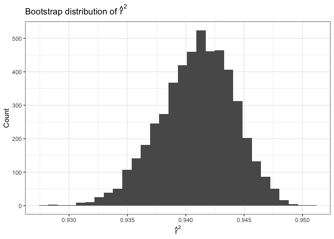

Homework 6
================
Xinyin Miao (xm2356)
2025-11-22

# Problem 1

``` r
homicides <- readr::read_csv("data/homicide-data.csv") |>
  clean_names() |>
  mutate(
    city_state = str_c(city, ", ", state),
    solved = if_else(disposition == "Closed by arrest", 1L, 0L),
    victim_sex  = na_if(victim_sex,  "Unknown"),
    victim_race = na_if(victim_race, "Unknown"),
    victim_age = ifelse(victim_age %in% c("Unknown", ""), NA, victim_age),
    victim_age = as.numeric(victim_age)
    ) |>
  filter(!city_state %in% c("Dallas, TX", "Phoenix, AZ", "Kansas City, MO", "Tulsa, AL"),
         victim_race %in% c("White", "Black")
         ) |>
  mutate(
    victim_sex  = factor(victim_sex,  levels = c("Female", "Male")),
    victim_race = factor(victim_race, levels = c("White", "Black"))
  )
```

    ## Rows: 52179 Columns: 12
    ## ── Column specification ────────────────────────────────────────────────────────
    ## Delimiter: ","
    ## chr (9): uid, victim_last, victim_first, victim_race, victim_age, victim_sex...
    ## dbl (3): reported_date, lat, lon
    ## 
    ## ℹ Use `spec()` to retrieve the full column specification for this data.
    ## ℹ Specify the column types or set `show_col_types = FALSE` to quiet this message.

## For Baltimore,MD

``` r
baltimore <-
  homicides |>
  filter(city_state == "Baltimore, MD")

baltimore_glm <-
  glm(
    solved ~ victim_age + victim_sex + victim_race,
    data   = baltimore,
    family = binomial()
  )
```

``` r
baltimore_results <-
  baltimore_glm |>
  tidy(
    conf.int     = TRUE,
    exponentiate = TRUE 
  )

baltimore_male_female_or <-
  baltimore_results |>
  filter(term == "victim_sexMale") |>
  select(term, estimate, conf.low, conf.high)

baltimore_male_female_or |> 
  knitr::kable(digits = 4)
```

| term           | estimate | conf.low | conf.high |
|:---------------|---------:|---------:|----------:|
| victim_sexMale |   0.4255 |   0.3242 |    0.5576 |

``` r
# the estimate and CI of the adjusted odds ratio for solving homicides comparing male to female victims keeping all other variables fixed
```

## For each of the cities

``` r
city_results <-
  homicides |>
  nest(data = -city_state) |>
  mutate(
    model = map(data, \(df) glm( solved ~ victim_age + victim_sex + victim_race,  data   = df, family = binomial())
    ),
    tidied = map(model, \(m) tidy(m,
        conf.int     = TRUE,
        exponentiate = TRUE
      )
    )
  ) |>
  select(city_state, tidied) |>
  unnest(tidied) |>
  filter(term == "victim_sexMale") |> 
  select(city_state, estimate, conf.low, conf.high) |> 
  arrange(desc(estimate))

city_results |> 
  knitr::kable(digits = 4)
```

| city_state         | estimate | conf.low | conf.high |
|:-------------------|---------:|---------:|----------:|
| Albuquerque, NM    |   1.7675 |   0.8247 |    3.7619 |
| Stockton, CA       |   1.3517 |   0.6256 |    2.9941 |
| Fresno, CA         |   1.3352 |   0.5673 |    3.0475 |
| Nashville, TN      |   1.0342 |   0.6807 |    1.5560 |
| Richmond, VA       |   1.0061 |   0.4835 |    1.9936 |
| Atlanta, GA        |   1.0001 |   0.6803 |    1.4583 |
| Tulsa, OK          |   0.9758 |   0.6091 |    1.5439 |
| Oklahoma City, OK  |   0.9741 |   0.6229 |    1.5200 |
| Minneapolis, MN    |   0.9470 |   0.4759 |    1.8810 |
| Indianapolis, IN   |   0.9187 |   0.6785 |    1.2413 |
| Charlotte, NC      |   0.8839 |   0.5507 |    1.3906 |
| Birmingham, AL     |   0.8700 |   0.5714 |    1.3138 |
| Savannah, GA       |   0.8670 |   0.4186 |    1.7802 |
| Las Vegas, NV      |   0.8373 |   0.6059 |    1.1511 |
| Durham, NC         |   0.8124 |   0.3824 |    1.6580 |
| Tampa, FL          |   0.8077 |   0.3395 |    1.8599 |
| Milwaukee, wI      |   0.7271 |   0.4951 |    1.0542 |
| Memphis, TN        |   0.7232 |   0.5261 |    0.9836 |
| Jacksonville, FL   |   0.7198 |   0.5359 |    0.9651 |
| Houston, TX        |   0.7110 |   0.5570 |    0.9057 |
| San Antonio, TX    |   0.7046 |   0.3928 |    1.2383 |
| St. Louis, MO      |   0.7032 |   0.5299 |    0.9319 |
| Washington, DC     |   0.6910 |   0.4660 |    1.0135 |
| Fort Worth, TX     |   0.6690 |   0.3935 |    1.1212 |
| Sacramento, CA     |   0.6688 |   0.3263 |    1.3144 |
| Boston, MA         |   0.6673 |   0.3508 |    1.2600 |
| Los Angeles, CA    |   0.6619 |   0.4565 |    0.9541 |
| San Francisco, CA  |   0.6075 |   0.3117 |    1.1551 |
| New Orleans, LA    |   0.5849 |   0.4219 |    0.8122 |
| Detroit, MI        |   0.5823 |   0.4619 |    0.7335 |
| Oakland, CA        |   0.5631 |   0.3637 |    0.8671 |
| Columbus, OH       |   0.5325 |   0.3770 |    0.7479 |
| Buffalo, NY        |   0.5206 |   0.2884 |    0.9358 |
| Miami, FL          |   0.5152 |   0.3040 |    0.8734 |
| San Bernardino, CA |   0.5003 |   0.1655 |    1.4624 |
| Philadelphia, PA   |   0.4963 |   0.3760 |    0.6499 |
| Louisville, KY     |   0.4906 |   0.3015 |    0.7836 |
| Denver, CO         |   0.4791 |   0.2327 |    0.9625 |
| Pittsburgh, PA     |   0.4308 |   0.2626 |    0.6956 |
| Baltimore, MD      |   0.4255 |   0.3242 |    0.5576 |
| San Diego, CA      |   0.4130 |   0.1914 |    0.8302 |
| Long Beach, CA     |   0.4102 |   0.1427 |    1.0242 |
| Chicago, IL        |   0.4101 |   0.3361 |    0.5009 |
| Cincinnati, OH     |   0.3998 |   0.2314 |    0.6670 |
| Omaha, NE          |   0.3825 |   0.1988 |    0.7109 |
| Baton Rouge, LA    |   0.3814 |   0.2043 |    0.6836 |
| New York, NY       |   0.2624 |   0.1328 |    0.4850 |

## Plot

``` r
city_results_plot <-
  city_results |>
  mutate(
    city_state = forcats::fct_reorder(city_state, estimate)
  )

city_results_plot |>
  ggplot(aes(x = estimate, y = city_state)) +
  geom_point() +
  geom_errorbar(aes(xmin = conf.low, xmax = conf.high), width = 0) +
  geom_vline( xintercept = 1, linetype   = "dashed") +
  labs(
    x     = "Adjusted OR of solving homicide (male vs female victims)",
    y     = "City",
    title = "Adjusted odds ratios for male vs female victims by city"
  ) +
  theme_minimal()
```

<!-- -->

The plot shows substantial variation across cities in the adjusted odds
of solving homicides for male versus female victims. Although many
cities have point estimates below 1—suggesting a tendency toward lower
clearance odds for male victims—the confidence intervals for nearly all
cities are wide and typically cross 1. Because this uncertainty is
large, the apparent pattern is not statistically reliable, and we cannot
confidently conclude that cases involving female victims are more likely
to be solved.

# Problem 2

``` r
library(p8105.datasets)
data("weather_df")
library(modelr)
```

## bootstrap fit

``` r
set.seed(123)

boot_results <-
  weather_df |>
  drop_na(tmax, tmin, prcp) |>
  bootstrap(n = 5000) |>
  mutate(
    model  = map(strap, ~ lm(tmax ~ tmin + prcp, data = .x)),
    glance = map(model, broom::glance),
    tidy   = map(model, broom::tidy),
    
    r_sq = map_dbl(glance, "r.squared"),

    beta_tmin = map_dbl(tidy, ~ .x |>
                          filter(term == "tmin") |>
                          pull(estimate)),
    beta_prcp = map_dbl(tidy, ~ .x |>
                          filter(term == "prcp") |>
                          pull(estimate)),

    beta_ratio = beta_tmin / beta_prcp
  )
```

## the plot of $\hat{r^2}$

``` r
boot_results |>
  ggplot(aes(x = r_sq)) +
  geom_histogram(bins = 30) +
  labs(
    x = expression(hat(r)^2),
    y = "Count",
    title = expression("Bootstrap distribution of " * hat(r)^2)
  ) +
  theme_bw()
```

<!-- -->

The bootstrap distribution of $\hat{r^2}$ is approximately symmetric and
bell-shaped, close to a normal distribution.

It is centered around roughly 0.94, indicating that the fitted model
consistently explains about 94% of the variability in tmax across
bootstrap samples and the linear association between tmax and the
predictors (tmin, prcp) is consistently strong.

It also shows moderate spread, with most values falling between 0.935
and 0.945. No extreme outliers—the tails taper smoothly on both ends.

## the plot of β1 / β2

``` r
boot_results |>
  ggplot(aes(x = beta_ratio)) +
  geom_histogram(bins = 30) +
  labs(
    x = expression(hat(beta)[1] / hat(beta)[2]),
    y = "Count",
    title = expression("Bootstrap distribution of " * hat(beta)[1] / hat(beta)[2])
  ) +
  theme_bw()
```

<!-- -->

The ratio $\frac{\hat{\beta_1}}{\hat{\beta_2}}$ compares the effect of
minimum temperature relative to the effect of precipitation.

The distribution is left-skewed with a long tail extending toward more
negative values.

The ratio shows substantial variability, mainly because the
precipitation coefficient is small and unstable across bootstrap
samples.

The long left tail (–300 to –400) indicates that small changes in the
prcp coefficient can produce relatively large negative ratios.

## the 2.5% and 97.5% quantiles

``` r
boot_results |>
  summarize(
    r2_lower      = quantile(r_sq, 0.025),
    r2_upper      = quantile(r_sq, 0.975),
    ratio_lower   = quantile(beta_ratio, 0.025),
    ratio_upper   = quantile(beta_ratio, 0.975)
  ) |> 
  knitr::kable(digits = 4, caption = "95% Bootstrap Confidence Intervals")
```

| r2_lower | r2_upper | ratio_lower | ratio_upper |
|---------:|---------:|------------:|------------:|
|   0.9344 |   0.9466 |   -277.1703 |   -125.7063 |

95% Bootstrap Confidence Intervals
